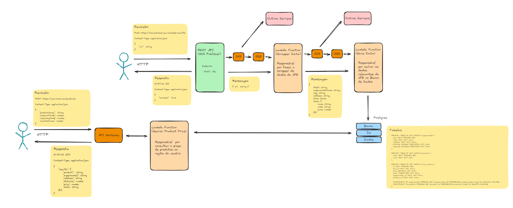

# Midas

Comparador de preços de produtos de supermercados.

## O projeto midas é composto por 3 repositórios:

Todos os repositórios estão públicos e contém informações de como executar-los.

- [SNS Publisher](https://github.com/marcosparreiras/sns-publisher-puc)
- [Scrapper Data](https://github.com/marcosparreiras/lambda-scrapper-puc)
- [Save Data](https://github.com/marcosparreiras/lambda-save-data-puc)



## Deploy

Foram feitos o deploy de todas as aplicações.

O `SNS Publisher` e o `Banco de dados Postgres` estão hospedados no render.

- SNS Publisher: https://sns-publisher-puc.onrender.com

Teste a aplicação substituindo o `[URL-DA-NFE-AQUI]` por uma url válida:

```bash
curl -X POST -H "Content-Type: application/json" -d '{"url": "[URL-DA-NFE-AQUI]"}' https://sns-publisher-puc.onrender.com/nfe
```


O `Scrapper Data` e o `Save Data` estão hospedados na AWS e contém um arquivo declarativo do Cloud Formation para provisionar a infraestrutura necessária (SNS, SQS e Lambda Function). Além dos serviços da AWS e de banco de dados Postgres o `Save Data` utiliza o Google API Geocoding, então é necessária o criação de uma `API_KEY` caso queira testar essa aplicação.

Tópicos SNS


Filas SQS


Lamdba Function


## Esquema do Banco de Dados

```sql

CREATE TABLE IF NOT EXISTS supermarkets (
  cnpj TEXT PRIMARY KEY,
  name TEXT NOT NULL,
  address TEXT NOT NULL,
  latitude DOUBLE PRECISION NOT NULL,
  longitude DOUBLE PRECISION NOT NULL
);

CREATE TABLE IF NOT EXISTS products (
  code TEXT PRIMARY KEY,
  name TEXT NOT NULL
);

CREATE TABLE IF NOT EXISTS price_history (
  id TEXT PRIMARY KEY,
  nfe_id TEXT NOT NULL,
  price DECIMAL NOT NULL,
  date TIMESTAMP NOT NULL,
  supermarket_id TEXT NOT NULL,
  product_id TEXT NOT NULL,

  CONSTRAINT fk_supermarket FOREIGN KEY (supermarket_id) REFERENCES supermarkets (cnpj) ON DELETE CASCADE,
  CONSTRAINT fk_product FOREIGN KEY (product_id) REFERENCES products (code) ON DELETE CASCADE
);
```
